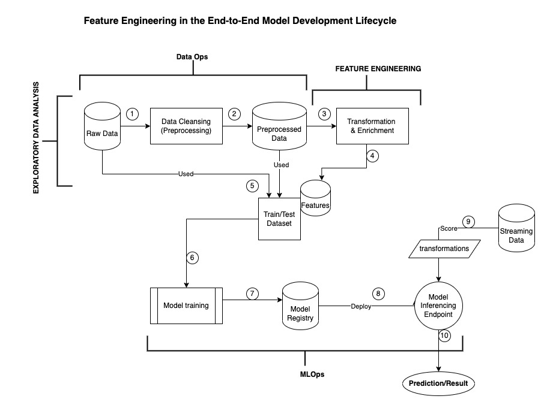
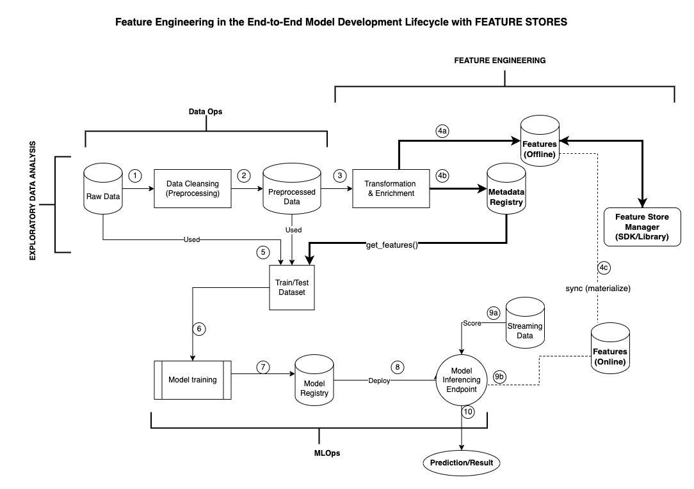

# Feature Store

Feature Store using Feast in Azure

## What is a feature?

Feature in the context of a Feature Store refers to the "Features" in Machine Learning/Data Science world. They are descriptive attributes about a dataset that help in model prediction, forecasting and more.

Raw data is rarely in a format that can be consumed by an ML model directly, so it needs to be transformed into features. This process is called feature engineering.

## Role of Features in the ML Model Development Lifecycle

### ML Lifecycle without Feature Stores

The above workflow showcases:

1. Raw Data is cleansed and processed
2. The preprocessed data is stored in a database
3. Data Scientist performs Transformations on this data to create features
4. These features along with raw or preprocessed data (depending on the usecase) are then used to create the train/test dataset for model training
5. Model is trained
6. The trained model is registered in a model registry
7. The trained model is then deployed on an endpoint
8. All streaming data should then go through the same transformations (as in step 3) before passing into the model for inference. It needs to be the same transformation logic so as to avoid training-inference skew.
9. The prediction result/score is then sent as output from the model inferencing endpoint

Clearly from the above workflow, it is clear that features and feature transformation logic are key for both training and inferencing. In that case, it is key to reuse the transformation logic and the computed feature values for both training and inference.

### ML Lifecycle with Feature Stores

Feature Stores are a software management toolkit that help you store metadata about the features for easy sharing and reuse. They also help sync the feature values and transformation logic between offline (batch data during training) and online (streaming data during inferencing) stores to avoid training-inference skew.
In addition to that, feature stores handles the complexity of doing correct point-in-time joins so the resulting data frame can be ingested by any model training libraries.

## Why Feature Stores?

Feature Stores can help with the following:

- Productionizing new features without extensive engineering support
- Share and reuse feature definition, transformation code, feature values and the pipelines across teams.
- Track feature versions, lineage, and metadata
- Achieve consistency between training and inferencing data.
- Monitor and perform analytics on the features in production

## What a Feature Store is not?

Given it's name as "Feature Store", it is often misunderstood as a storage system and more. Here's a brief of what a Feature Store doesn't offer.

- Is NOT a Storage System or data warehouse, they do not inherently store any data.
- Does NOT automatically do feature engineering, feature importance, feature validation or provide any automatic feature suggestion on raw data. Still requires human-in-the-loop.
- Is NOT a ETL or ELT system – doesn’t help with movement of data from one source to another.
- Is NOT meant for general-purpose data cataloging that simply stores all metadata of the organization.

## Feature Store Capabilities and Benefits

Most feature store implementations currently offer the following capabilities:

- Metadata Catalog of Features for tracking, reuse, and governance
- Lineage Tracking for reproducibility and model governance at the feature level
- Feature transformation code integration for easy feature sharing and reference
- Point-in-time correct data that abstracts joins from the data scientist and can be consistently reproduced for the same dataset with the specified time frame
- Minimize Training-Inference Skew: Skew usually happens when there is inconsistency in feature values between model training and model inferencing.
- Reusability and discovery of features across different teams to reduce cold-start and avoid duplicated effort.
- Standardization of Feature Creation and Retrieval Process for ease of maintenance
- Abstraction of Feature Data layer from ML model: Feature consumption abstracted to one layer (Feature Registry/Catalog) instead of tracking multiple data source(s)

## Do you need a Feature Store for your usecase?

Feature Stores are not applicable for every ML usecase and every team. As setting up a feature store and maintaining it requires some engineering effort, it is important to weigh the trade-offs on setting up a feature store.

The following questions should help assess the need for a feature store and also pick the right feature store offering that best suits the needs:

1. How many models does your organization, or your Data Science team have/develop?
2. What is the order of magnitude of features do you have? – 10s, 100s, 1000s?
3. Among these features how often do data scientists perform point-in-time joins for creating train/test dataset or creating derived features or etc..?
4. Do your data scientists reuse these features – developed within or outside your team?
5. Do they “regenerate” feature values/tables when reusing?
6. Do they reuse feature values or feature transformation code or both?
   If they do not reuse, why not?
7. Do you need feature-level or dataset-level granularity when it comes to:
   - Versioning
   - Lineage
   - Reproducibility
8. Will your team benefit from having a dashboard to discover features for reuse or analytics?
   - If yes – how do you plan to use the dashboard?: This will help pick the right Feature Store offering.
   - If no – why not?

## Example 1: Driver/Taxi Stats using Feast, Snowflake and Redis

Following is a simple example using Feast, an OSS Feature Store. In the example, Snowflake is used an offline store and Redis is used as an online store

### Usage Instructions

1. Create a python virtual environment to install all libraries
   `virtualenv <env_name>`
2. Activate the virtual environment
   `source <env_name>/bin/activate`
3. Install all dependencies required for the example
   `pip install -r requirements.txt`
4. Run the following commands from `feature_repo` directory
5. To upload feature values(data) into your database, run `python upload_data.py`
6. To create the **feature registry** and register the features, run `python create_features.py`
7. To consume/fetch the features from offline store(Snowflake), run `python consume_features.py`
8. To fetch feature from online store(Redis), run `python get_online_features.py`

## Example 2: Building a Credit Risk Model: an end-to-end lifecycle from feature engineering to inferencing.

### Data

Kaggle Dataset is used here: https://www.kaggle.com/competitions/home-credit-default-risk/data

### Technologies and Libraries

1. Storage:
   - Offline: Snowflake
   - Online: Redis
   - Registry/Metadata Catalog: Azure Blob Storage Account
2. Hosted in Azure
   1. AKS for compute
   2. Azure ML for ML Pipeline

### Architecture

#### Workflows

### Add a new Feature using Feature Store (CI)

### Feature Values Generation and Definition Registration (CD)

### Feature Consumption during Model Training and Serving

### Usage Instructions

TBD
