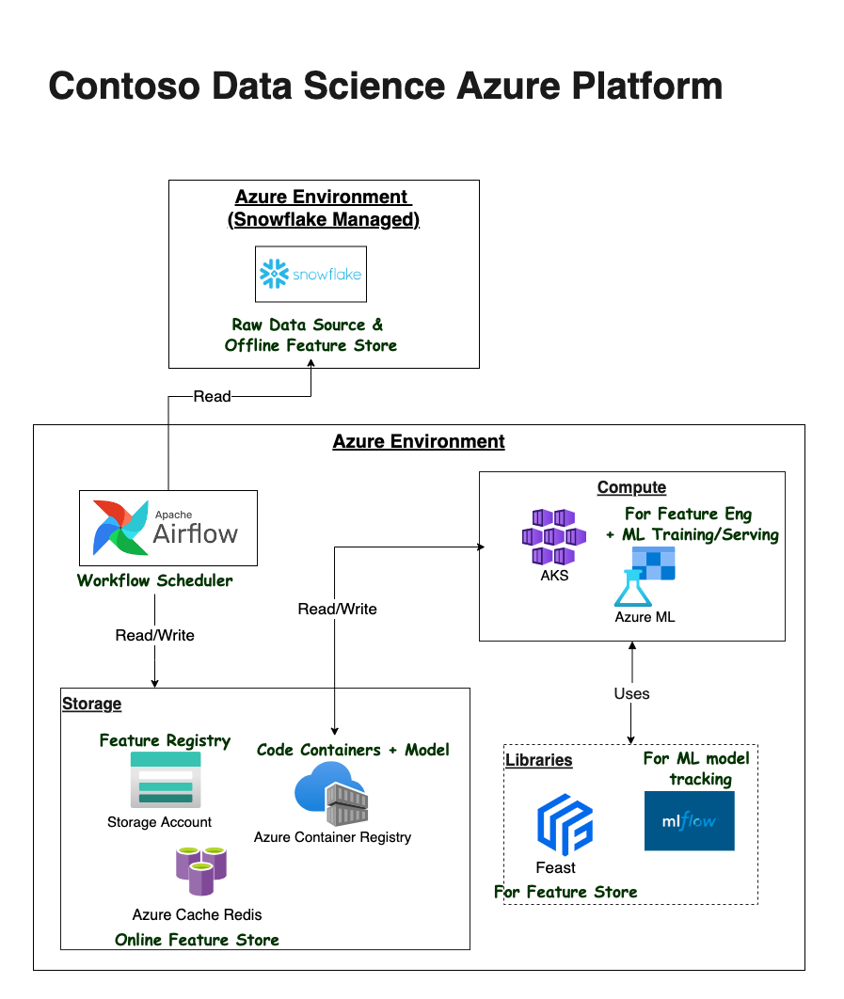
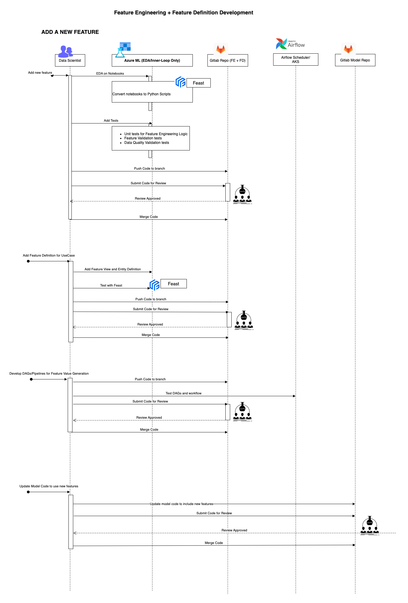
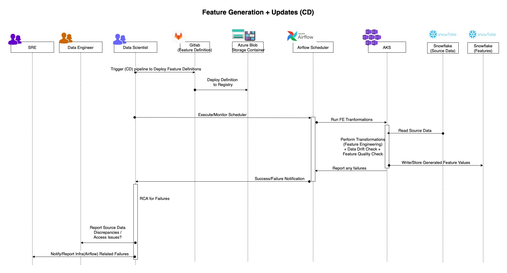
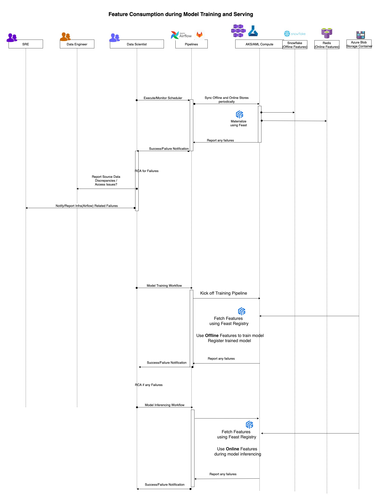

# Feature Store

Feature Store using Feast in Azure

## Getting started

TBD

## Architecture

## Workflows

### Add a new Feature using Feature Store (CI)

### Feature Values Generation and Definition Registration (CD)

### Feature Consumption during Model Training and Serving

