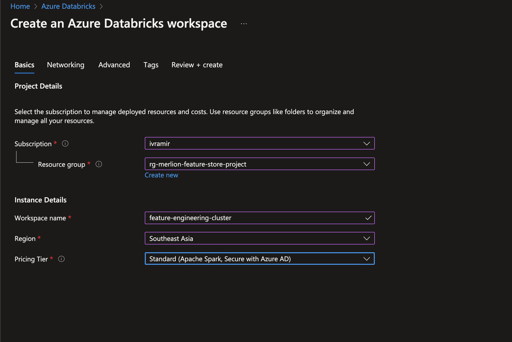
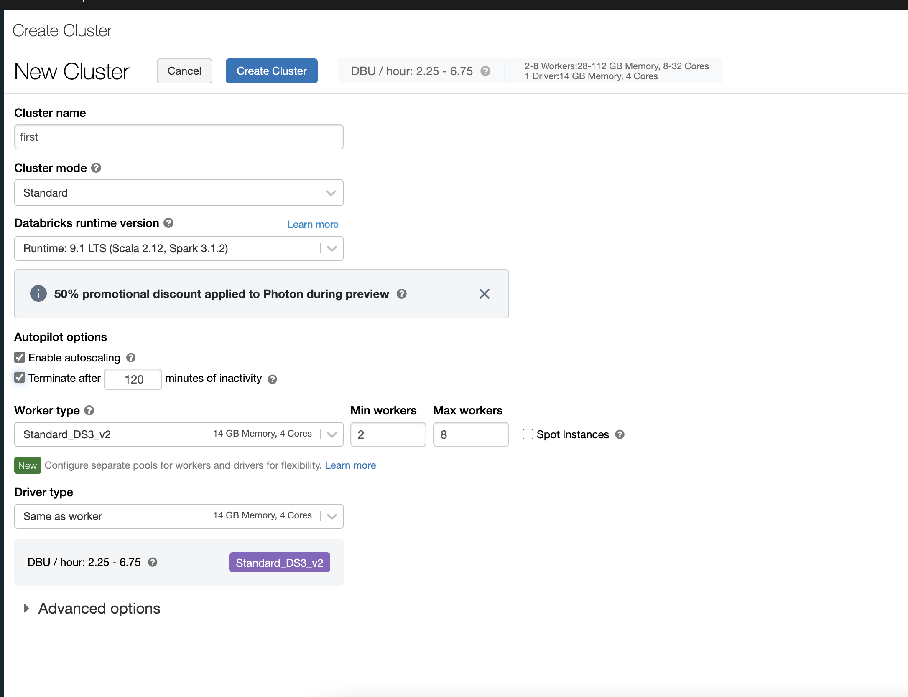

# Infrastructure Setup

Following are the Azure services and other infrastructure setup required:

1. Azure Resource Group
2. Azure Key Vault
3. Azure Storage Account
4. Azure Databricks Cluster
5. Azure Redis Cache
6. Snowflake on Azure

## Configuration Details

### Resource Group

TBD

### Databricks Cluster

There are two main steps involved when creating a Databricks cluster:
  1. Creating the databricks infrastructure on Azure portal and
  2. Creating the databricks cluster itself.
Detailed below is the configurations settings and setup required for each the above steps.

Creation of the resources on Azure:

Creation of the cluster on Databricks:

