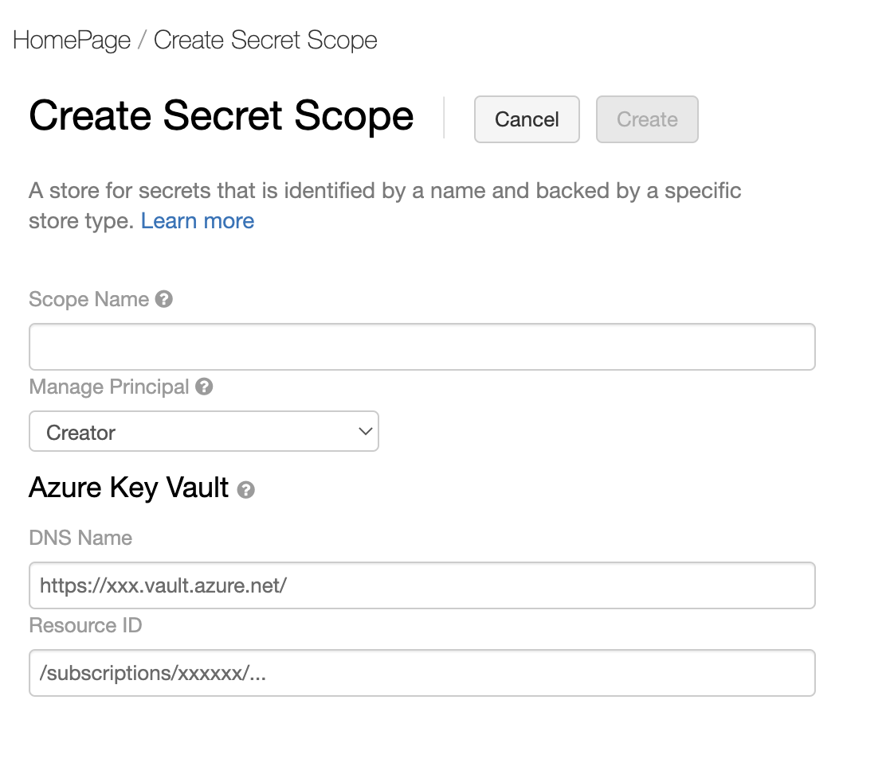
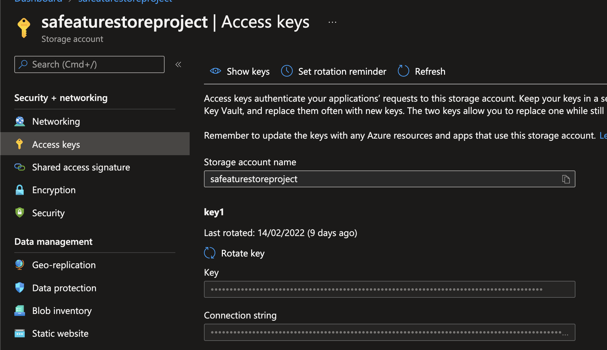

# Key Vault & Storage Account Access on Azure Databricks

## Key Vault Access

For securely retrieving secrets, Azure Databricks allows linking a Databricks instance to a Key Vault.

1. Go to your Databricks cluster and append '#secrets/createScope' to the end of your url. The databricks url should look something like this: 'https://<\location>.azuredatabricks.net/?o=<\orgID>#secrets/createScope'.

2. Create a scope and point the scope to your key vault url. Kepe in mind the scope name - that will be used to refer to the key vault when retrieving secrets in the next step. Ideally, one scope would be aligned to one key vault.
3. In any databricks notebook, we can refer to the secret as below:
    ```
    dbutils.secrets.get("<scope-name>", "<secret-name>")
    ```

## Blob Storage Access

1. Add Storage Account Key 1 to the keyvault as a secret. Pick up the key from the 'Access Keys' section on the Storage Account page. This will be used in step two.

    

2. Create a notebook in the databricks cluster and mount the blob storage container through this command:
    ```
    dbutils.fs.mount(source = "wasbs://<your-container-name>@<your-storage-account-name>.blob.core.windows.net", 
                        mount_point = "/mnt/<mount-name>", 
                        extra_configs = {"<conf-key>":dbutils.secrets.get(scope = "<scope-name>", key = "<key-name>")})
    ```

    ​Conf key is fs.azure.account.key.<storage-account-name>.blob.core.windows.net
    mount_point refers to a name of your choice through which we can access the contents of the blob storage container form the notebook
    key-name refers to the name of the key that holds the storage account key from Step 1.

3. We can read from the container using PySpark:
    ```
    df = spark.read.text("/mnt/<mount-name>/diabetes.csv") 
    df.show() 
    ```


